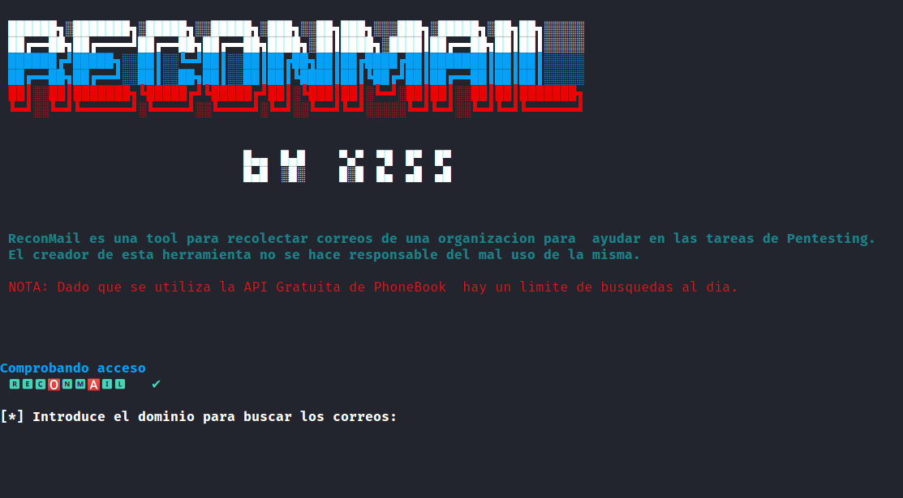

#

**reconMail** es una Herramienta para recolectar correos electrónicos, ideal para **BugBountys**, **Pentesting**, **Hackers Éticos**, **REDTEAM**

**IMPORTANTE**: Dado que se utiliza el servicio Gratuito de PhoneBook (intelX.io) el numero de busquedas queda limitado diariamente.
              **El creador de esta herramienta no se hace responsable del mal uso de la misma.**

Instalación
======

git clone https://github.com/oski02/reconMail.git \
cd reconMail \
chmod +x reconMail.sh \
./reconMail.sh \

¿Cómo funciona?
======
La herramienta nos preguntará por el dominio que queremos buscar los correos:

Encontrar mails que tengan algun leeak
======

Combinando con la herramienta h8mail podremos ser capaces de detectar si los correos que hemos buscado presentan algún leak de informacion. \

Pasos a seguir:

1. instalamos h8mail

pip3 install h8mail

2. Ejecutamos reconMail

./reconMail

3. Pasamos la salida de reconMail a h8mail

cat mails-xxx.xx.txt | xargs h8mail -t

